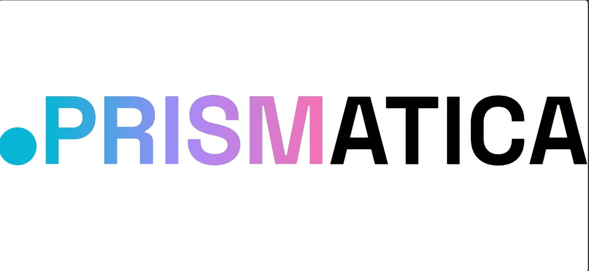

# PrismaticaUI



## 📋 Project Description and Purpose

PrismaticaUI is a comprehensive **Inventory Management System** designed to streamline warehouse operations and provide intelligent insights for business decision-making. The application combines real-time inventory tracking with AI-powered analytics to optimize stock levels, predict purchasing needs, and enhance operational efficiency.

### Key Features

- 🏢 **Multi-Branch Management**: Manage multiple branches from a single dashboard
- 📊 **Real-time Analytics**: Live inventory tracking with detailed stock reports
- 🤖 **AI-Powered Insights**: Intelligent analysis purchase recommendations
- 📦 **Smart Purchase Orders**: Automated purchase order generation based on stock levels and AI recommendations
- 💰 **Sales & Purchase Tracking**: Complete transaction management for sales and purchases
- 📈 **Interactive Dashboards**: Data visualization with charts and statistics
- 🔍 **Advanced Search**: Smart autocomplete for products and branches

### Business Value

- **Optimize Inventory Levels**: Prevent stockouts and overstock situations
- **Reduce Costs**: AI-driven purchasing recommendations minimize waste
- **Improve Efficiency**: Streamlined workflows for inventory operations
- **Data-Driven Decisions**: Comprehensive analytics and reporting
- **Scale Operations**: Multi-branch support for growing businesses

## 🚀 Installation Instructions

### Prerequisites

Before you begin, ensure you have the following installed on your system:

- **Node.js** (v18.0.0 or higher)
- **npm** (v8.0.0 or higher) or **yarn**
- **Git**

### Step 1: Clone the Repository

```bash
git clone https://github.com/metaphaz/PrismaticaUI.git
cd PrismaticaUI
```

### Step 2: Install Dependencies

```bash
npm install
```

### Step 3: Environment Configuration

Create a `.env` file in the root directory and configure your environment variables:

```env
# API Configuration - Update this to match your backend API
VITE_API_BASE_URL=https://ae8aa5699e02.ngrok-free.app

# Examples for different environments:
# For production: VITE_API_BASE_URL=https://your-production-api.com
# For local development: VITE_API_BASE_URL=http://localhost:8080
```

### Step 4: Start the Development Server

```bash
npm run dev
```

The application will be available at `http://localhost:5173`

### Step 5: Build for Production

```bash
npm run build
```

## 📖 Usage Guide

### Getting Started

1. **Dashboard Overview**: Access the main dashboard to view overall inventory statistics and key metrics
2. **Branch Management**: Navigate to the branches section to view and manage individual warehouses
3. **Inventory Operations**: Use the inventory section for stock management, purchases, and sales

### Core Workflows

#### Overview and Statistics

1. Navigate to **Dashboard**
2. View statistics for all of your branches
3. Click on **Get Insights** to get an AI report on your inventory

#### Managing Branches

1. Navigate to **Branches**
2. View all branch locations with real-time statistics
3. Click on any branch to access detailed information including:
   - Stock utilization and capacity
   - AI-powered insights and analysis
   - Purchase recommendations
   - Detailed inventory breakdown

#### AI-Powered Purchase Orders

1. Select a branch to view detailed analytics
2. Wait for AI analysis to complete
3. Review automatically generated purchase recommendations
4. Select items to order
5. Click "Order Products" to process transactions

#### Managing Purchases

1. Navigate to **Purchases**
2. Search and select products using smart autocomplete
3. Enter quantity and cost
4. Select the receiving branch
5. Submit to add stock and create purchase records

#### Recording Sales

1. Navigate to **Sales**
2. Search and select products using smart autocomplete
3. Enter quantity and unit price
4. Select the branch for the transaction
5. Submit to record the sale and update inventory

### Navigation Structure

```
├── Dashboard (Overview & Statistics)
└── Inventory Management
    ├── Products (Product Catalog)
    ├── Stock Levels (Current Inventory)
    ├── Purchases (Purchase Management)
    ├── Sales (Sales Management)
    └── Branches (Branch Management)

```

## 🛠️ Technologies Used

### Frontend Framework & Libraries

- **React 18** - Modern JavaScript library for building user interfaces
- **TypeScript** - Type-safe JavaScript development
- **Vite** - Lightning-fast build tool and development server
- **React Router DOM** - Client-side routing for single-page applications

### UI Components & Styling

- **Tailwind CSS** - Utility-first CSS framework for rapid UI development
- **Radix UI** - Accessible, unstyled UI primitives
- **Tabler Icons** - Clean and minimal icon set
- **Sonner** - Toast notifications for user feedback

### Data Visualization

- **Recharts** - Composable charting library for React
- **Custom Chart Components** - Tailored visualizations for inventory data

### Development Tools

- **ESLint** - Code linting and quality enforcement
- **TypeScript Compiler** - Type checking and compilation
- **PostCSS** - CSS transformation and optimization

### Backend Integration

- **REST APIs** - Integration with inventory management backend
- **Fetch API** - Modern HTTP client for API communications
- **Real-time Data** - Live inventory updates and synchronization

### Key Features Implementation

- **Smart Autocomplete** - Debounced search with dropdown suggestions
- **State Management** - React hooks for complex application state
- **Error Handling** - Comprehensive error boundaries and user feedback

## 👥 Team Members

### Core Development Team

- **Yiğit Muhittin Özan** - *AI Developer*
  - AI integration and intelligent analytics implementation
  - Machine learning algorithms for inventory prediction
  - Purchase recommendation system development
  - Backend API development for AI services

- **Jack Emre Flett** - *Full-Stack Developer*
  - Frontend development with React & TypeScript
  - UI/UX design implementation
  - API integration

### Acknowledgments

- **AI Integration** - Llama 4 Scout for intelligent insights and recommendations
- **Design Inspiration** - Modern inventory management best practices
- **Open Source Community** - Various libraries and tools that made this project possible

## 📚 Additional Information

### Project Structure

```
PrismaticaUI/
├── src/
│   ├── components/       # Reusable UI components
│   │   ├── ui/           # Base UI components
│   │   ├── add-purchase-card.tsx
│   │   ├── add-sales-card.tsx
│   │   ├── branches-section-cards.tsx
│   │   └── ...
│   ├── pages/            # Page components
│   │   ├── BranchDetailsIndex.tsx
│   │   ├── Index.tsx
│   │   └── ...
│   ├── hooks/            # Custom React hooks
│   ├── layouts/          # Layout components
│   ├── lib/              # Utility functions
│   └── assets/           # Images and static files
├── package.json          # Dependencies and scripts
├── tailwind.config.js    # Tailwind CSS configuration
├── tsconfig.json         # TypeScript configuration
└── vite.config.ts        # Vite build configuration
```

### API Endpoints

The application integrates with the following key endpoints:

- `/api/warehouses` - Branch management
- `/api/products` - Product catalog and search
- `/api/inventory` - Stock levels and transactions
- `/api/ai/analysis` - AI insights and recommendations

### License

This project is licensed under the MIT License - see the [LICENSE](LICENSE) file for details.